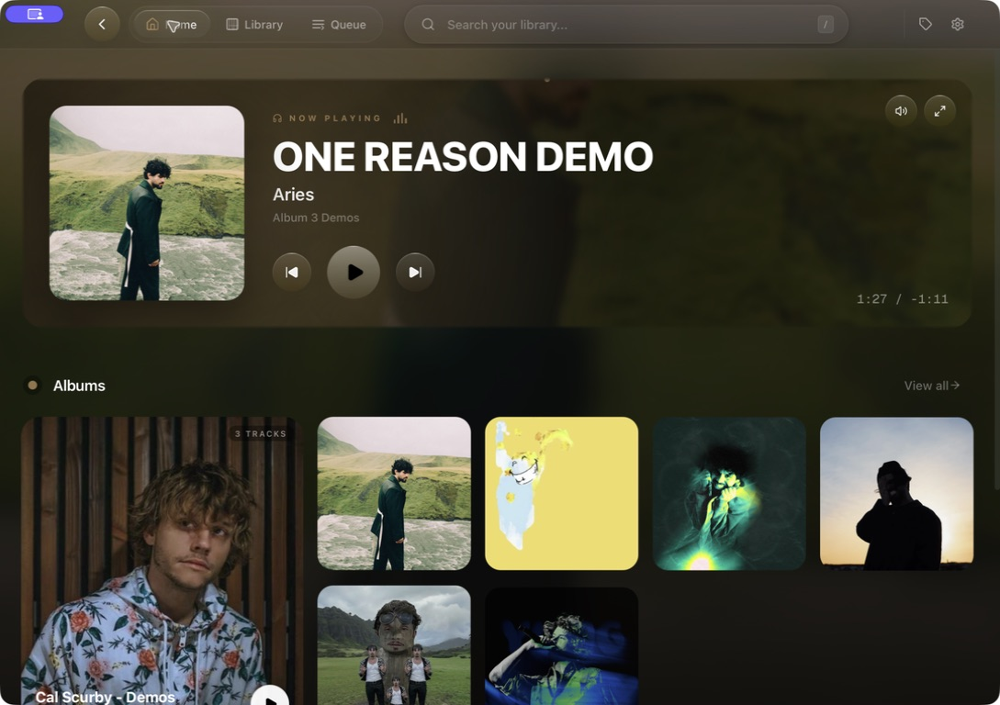
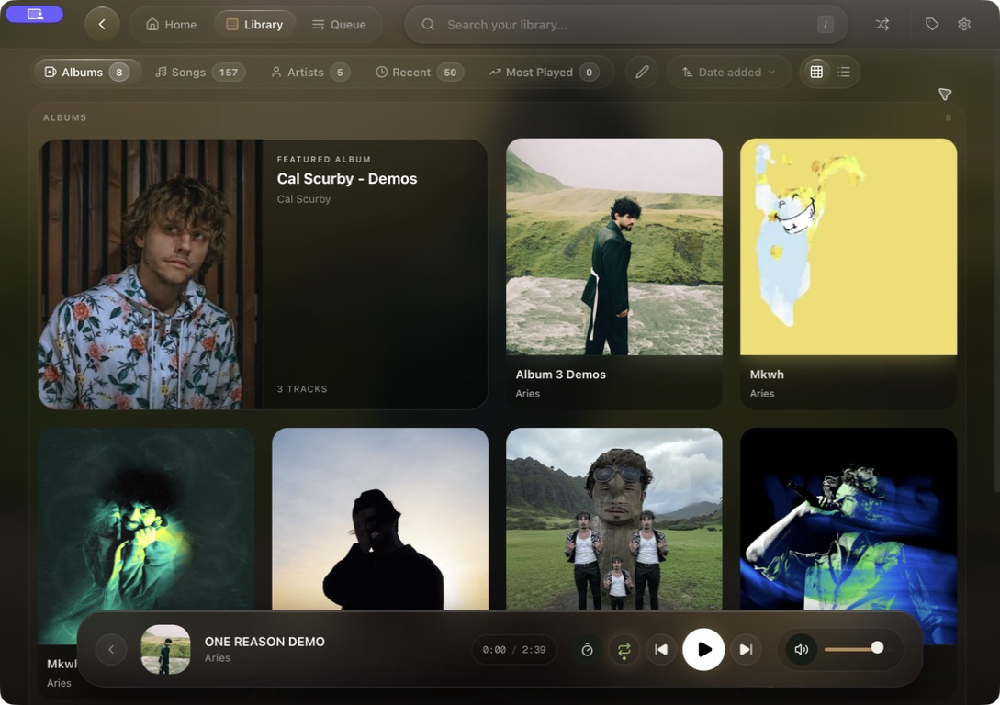
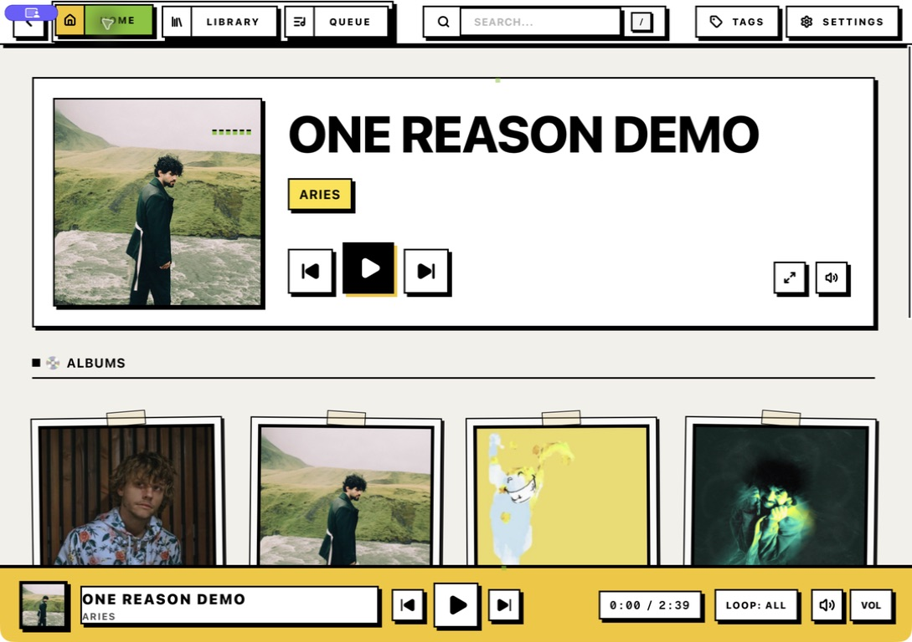

<p align="center">
  
</p>

<h1 align="center">Tarab</h1>

<p align="center">
  A modern local music player built around timed lyrics, library management, and interface design.
</p>

Tarab is a desktop music player for people who want the control of a serious local library without an interface that feels decades old.

It combines a polished album-first library with deeply integrated timed lyrics, a built-in LRC editor, metadata editing, smart playlists, native desktop controls, and two complete visual systems.

Tarab runs on macOS, Windows, and Linux.

> **Project status:** Tarab is under active development. No official binary release is currently available. Developers and testers can run or build it from source.



## What makes Tarab different

Many local music players are powerful, but their interfaces remain dense, dated, or dependent on plugins.

Tarab treats interface design, lyrics, playback, and library management as parts of the same product.

Its main focus is not simply playing local files. It is making a large music library feel polished, visual, and pleasant to use.

### Lyrics are part of the entire application

Timed lyrics are not limited to a small panel beside the player.

Tarab integrates lyrics into playback, search, editing, and the full-screen listening experience.

It includes:

* full-screen timed lyrics
* synchronized line highlighting
* embedded lyric support
* local sidecar lyric support
* automatic LRCLIB lookup
* lyric-text search
* adjustable lyric size and alignment
* artwork-driven lyric backgrounds
* background blur and motion controls
* a built-in LRC editor

Lyrics remain connected to the track, library, search, and playback experience instead of behaving like a separate add-on.

### Edit timed lyrics without leaving the player

Tarab includes a built-in LRC editor for creating, correcting, and synchronizing timed lyrics.

You can:

* add lyrics to a track
* edit lyric text
* create timed lyrics
* adjust existing timestamps
* synchronize lines with playback
* correct downloaded lyrics
* fix individual mistimed lines

You do not need a separate LRC application just to repair or create lyrics for one track.

### Fix metadata inside your library

Tarab also includes a built-in tag editor.

You can correct track information without leaving the player or opening another application.

Tag changes feed directly back into Tarab’s:

* album views
* artist views
* search
* sorting
* filters
* playlists
* library organization

Track number, disc number, format, bitrate, sample rate, and file size persist in the library
database. A rescan updates media metadata without resetting ratings, play history, or playlist
membership.
Scan paths cross the desktop boundary in bounded 500-path chunks. Rust applies the final folder
reconciliation in one database transaction.

File removal uses Tarab Trash by default. Tarab stores a bounded recovery record and returns one
undo token per successful file. Permanent deletion is a separate action with a second
confirmation.

### A modern interface for a serious library

Tarab is designed as a complete desktop application rather than a utility wrapped around a track list.

The interface includes:

* album-first browsing
* artwork-focused layouts
* fast search and filtering
* a persistent player bar
* a full-screen player
* a compact always-on-top mini player
* native menus and shortcuts
* hardware media-key support
* operating-system playback controls
* motion and visual effects that respect reduced-motion settings

## Two complete visual systems

Tarab includes two full interface systems.

These are not simple color themes. They change the appearance and behavior of navigation, cards, dialogs, settings, editors, playlists, controls, and playback surfaces.

### Liquid Glass

Liquid Glass uses:

* album-art colors
* soft depth
* layered glass surfaces
* restrained WebGL motion
* blurred backgrounds
* smooth transitions
* artwork-driven presentation



### Neobrutalism

Neobrutalism rebuilds the interface with:

* hard borders
* mechanical controls
* bold state indicators
* high contrast
* paper-like textures
* rigid layouts
* direct visual feedback



Both systems preserve the same library, playback, lyric, and editing features.

Tarab also respects the operating system’s reduced-motion preference and includes a Reduced Effects setting.
The system preference always wins. The Background setting also stops animated and cover-driven
background layers instead of only hiding their controls.

## Your library has structure

Tarab turns selected music folders into a structured album and artist library.

You can:

* browse albums, artists, tracks, playlists, and tags
* search track metadata
* search lyric text
* edit track metadata
* rate tracks
* inspect play counts
* identify missing files
* keep missing files visible until you resolve them
* watch approved folders for changes

Tarab supports three playlist types.
Open **Playlists** from the primary navigation to create a collection, inspect its tracks, see
unavailable entries, or refresh a folder-synced source.

### Manual playlists

Choose tracks directly and control their order.

Add and reorder requests carry an idempotency key. A repeated request returns the first completed
playlist result instead of applying the mutation twice.

### Smart playlists

Build collections from rules based on your library metadata.

### Folder Sync playlists

Keep a playlist synchronized with the contents of a selected folder.
Tarab creates a native library grant when you choose the folder. Manual sync validates that grant,
uses all indexed tracks below the folder, preserves missing-track snapshots, and reports files that
still need a library scan.

When an approved music folder changes, Tarab can refresh the library automatically.

## Playback

Tarab uses a Rust audio engine and supports:

* gapless playback
* next-track preloading
* crossfade
* playback speed control
* volume control
* volume boost
* audio output selection
* queue management

The in-app playback surface is the **Now Playing bar**. The separate always-on-top window is the
**Floating mini window**. The full player uses the same edge-mounted seek control as the Home hero.
It resolves packaged cover art from Tarab’s validated app-owned cache and repairs missing cached
thumbnails from an authorized source file when possible.
* smart shuffle
* shuffle history
* repeat modes

You can control Tarab through:

* hardware media keys
* custom global shortcuts
* the application menu
* the system status icon
* operating-system media controls
* the always-on-top mini player

Audio file associations and `tarab://` links can send tracks or library searches into the application.

## Feature reference

### Lyrics

* embedded lyrics
* local sidecar lyrics
* timed LRC lyrics
* synchronized line highlighting
* full-screen lyric view
* built-in LRC editor
* timestamp editing
* lyric synchronization
* lyric-text search
* optional LRCLIB lookup
* adjustable text size
* adjustable alignment
* background blur controls
* background motion controls

### Library and playlists

* album view
* artist view
* track view
* playlist view
* tag view
* metadata search
* lyric search
* manual playlists
* smart playlists
* folder-sync playlists
* tag editing
* ratings
* play counts
* missing-file handling
* native folder grants
* file watching
* migration from older Tarab storage

### Playback

* gapless playback
* next-track preloading
* crossfade from 0 to 12 seconds
* queue management
* smart shuffle
* shuffle history
* repeat modes
* playback speed control
* volume control
* volume boost
* audio output selection

### Desktop integration

* hardware media keys
* operating-system playback actions
* custom global shortcuts
* application menu commands
* system status icon
* hide-on-close support
* always-on-top 320 × 92 mini player
* open at login
* audio file associations
* `tarab://` deep links

### Appearance and accessibility

* Liquid Glass interface
* Neobrutalism interface
* artwork-driven colors
* WebGL visual effects
* Reduced Effects setting
* operating-system reduced-motion support
* luminance-aware foreground colors
* high-contrast interaction states

## Where Tarab fits

| Player                                               | Main focus                                                                           | Choose Tarab for                                                                                                                                              |
| ---------------------------------------------------- | ------------------------------------------------------------------------------------ | ------------------------------------------------------------------------------------------------------------------------------------------------------------- |
| **Tarab**                                            | A designed local library with deep timed-lyrics integration.                         | Modern interface design, a built-in LRC editor, a built-in tag editor, full-screen timed lyrics, and the same product model across macOS, Windows, and Linux. |
| [MusicBee](https://getmusicbee.com/)                 | Windows library maintenance, auto-tagging, CD tools, DSP, and audio-driver support.  | A cross-platform interface, deeper first-party lyric integration, and built-in lyric editing.                                                                 |
| [foobar2000](https://www.foobar2000.org/)            | Codec depth, conversion, DSP, ReplayGain, and a component ecosystem.                 | A complete visual experience that does not require assembling plugins for lyrics, playlists, desktop controls, and interface design.                          |
| [Strawberry](https://www.strawberrymusicplayer.org/) | Collection management, tag sources, radio, server integrations, and device transfer. | A stronger focus on timed lyrics, editing, artwork, and full-screen playback presentation.                                                                    |

MusicBee offers more Windows-specific library and audio tools.

foobar2000 offers deeper codec, DSP, conversion, and extension support.

Strawberry offers more external music sources and server integrations.

Tarab focuses on combining the library tools most listeners need with a modern interface and a complete timed-lyrics workflow.

## Local data and network behavior

Tarab stores its library information locally.

Local data includes:

* the library database
* playlists
* settings
* player session
* artwork cache
* application logs

Offline playback and library management make no network requests.

Optional LRCLIB lookup sends track metadata to LRCLIB only after you enable that feature.

The native Rust backend controls access to music folders. Renderer code cannot grant itself access to arbitrary paths.

File-association requests use bounded choices:

* **Play once**
* **Import folder**
* **Cancel**

Tarab does not require an account and includes no analytics or crash-reporting client.

## Supported audio files

Tarab scans the following formats:

`MP3` · `FLAC` · `WAV` · `OGG` · `M4A` · `AAC` · `AIFF` · `ALAC` · `WMA`

Actual decoding and metadata support depend on Tarab’s Rust audio and metadata libraries.

## Project status

Tarab is under active development.

There is currently no official downloadable binary release.

The application can be run or built from source for development and testing. Local builds may be unsigned and can trigger operating-system security warnings.

Current target platforms:

* macOS 12 or newer
* Windows 10 22H2 or newer
* Ubuntu 22.04
* Debian 12
* compatible newer Linux distributions

Platform support is still being tested. A successful local build does not guarantee that every platform-specific feature works correctly.

## Build from source

### Requirements

Install the following before building Tarab:

* Node.js 22.18.0 from `.nvmrc`
* pnpm 9.15.2
* Rust 1.92.0 from `rust-toolchain.toml`
* Git
* the Tauri system dependencies for your operating system

### Clone the repository

```bash
git clone https://github.com/Faw47/tarab.git
cd tarab
```

### Install dependencies

```bash
nvm use
pnpm install --frozen-lockfile
```

### Run the desktop application

```bash
pnpm dev:app
```

### Run the frontend only

This mode is useful for isolated interface development. Native playback and desktop features may not work.

```bash
pnpm dev
```

### Run Storybook

```bash
pnpm storybook
```

### Build a local application bundle

```bash
pnpm build:app
```

Generated bundles are placed under the Tauri target directories inside `src-tauri/target/`.

Local bundles are intended for development and testing. They may not be signed, notarized, or suitable for public distribution.

## Development checks

Run the standard code gate:

```bash
pnpm verify
cargo check --manifest-path src-tauri/Cargo.toml
```

The frontend gate checks:

* TypeScript
* Biome
* Vitest
* the typed IPC contract
* the production web build
* the initial bundle limit

Run the complete release-quality gate:

```bash
pnpm verify:release
```

The release gate checks:

* TypeScript
* Biome
* Vitest
* the IPC contract
* the production web build
* the initial bundle limit
* Storybook
* unused code and dependencies
* release configuration
* Rust formatting
* Rust tests
* Clippy with warnings denied

Run dependency audits:

```bash
pnpm audit:dependencies
```

## Architecture

Tarab uses:

* Tauri 2
* React 19
* TypeScript
* Rust
* SQLite
* Zustand
* TanStack Query
* Vitest
* Storybook
* Three.js

```text
src/
  components/        shared interface and player surfaces
  features/          playback, library, playlists, lyrics, and settings
  store/             interface, settings, and player state
  graphics/          Liquid Glass WebGL effects
  test/              frontend test helpers and mocks

src-tauri/src/
  audio.rs                playback engine
  database.rs             SQLite library database
  desktop_integration.rs  status icon, menus, shortcuts, and controls
  file_ops.rs             validated file operations
  image_cache.rs          artwork and image cache
  launch_intents.rs       deep links and file associations
  library.rs              folder scanning
  library_watcher.rs      approved-folder watching
  lyrics.rs               local and LRCLIB lyrics
  metadata.rs             music metadata extraction
  playlist.rs             playlist storage and rules
  session.rs              playback session migration
  tageditor.rs            metadata editing
  waveform.rs             waveform generation
```

### Main window authority

The main window owns:

* playback state
* queue state
* library state
* playlist state
* settings state

The mini player receives typed snapshots from the main window and sends typed control requests back to it.

The mini player does not own persistent library or playback state.

### Native command boundary

Custom Rust commands are restricted to the main window at the invoke-handler boundary.

Renderer code cannot grant itself arbitrary filesystem access.

Library paths must be approved through the native folder-selection flow.

### Optional network access

Tarab is designed to work without a network connection.

Optional LRCLIB lookup is the primary normal network feature. It remains disabled until the user enables it.

## Documentation

More implementation details are available in:

* [Frontend architecture](docs/frontend-architecture.md)
* [Security review](docs/security-review.md)
* [Release hardening](docs/release-hardening.md)
* [Release evidence](docs/release-evidence-1.0.0.md)
* [Playlist manual QA](docs/playlist-v2-manual-qa.md)
* [Design language](docs/design/design_language.md)
* [Neobrutalism design language](docs/design/neobrutalism_design.md)
* [Agent and contributor guidance](AGENTS.md)

## Contributing

Tarab is still early in development.

Bug reports, compatibility reports, design feedback, and focused pull requests are welcome.

Before opening a pull request:

1. Read `AGENTS.md`.
2. Preserve the native filesystem and IPC boundaries.
3. Follow the relevant design-language documentation.
4. Add or update tests when behavior changes.
5. Run the relevant validation commands.
6. Explain any platform-specific behavior or limitations.

Discuss large architectural changes in an issue before implementation.

## Security

Do not publish suspected security vulnerabilities in a public issue.

Security-sensitive areas include:

* filesystem path validation
* music metadata parsing
* file associations
* deep links
* Tauri capabilities
* custom Rust commands
* renderer-to-native IPC
* library grants
* playlist and database mutation
* vendored native plugins

Until a dedicated security-reporting process is published, contact the maintainer privately through the GitHub profile associated with this repository.

## License

Tarab is licensed under the [MIT License](LICENSE).
